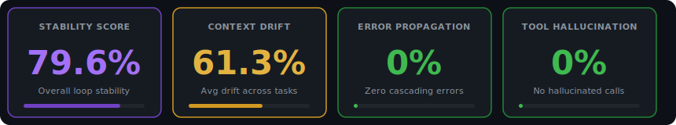
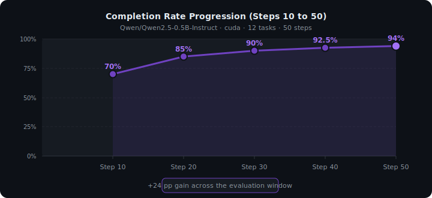
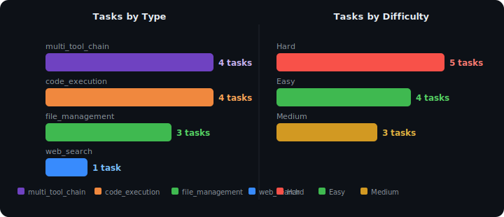

# Agentic Loop Stability Evaluation

[](https://heyneo.so)

[](https://huggingface.co/datasets/daksh-neo/agentic-loop-stability-eval)
[](https://marketplace.visualstudio.com/items?itemName=NeoResearchInc.heyneo)

> This project was autonomously built using **NEO** — Your autonomous AI Agent. [Try NEO →](https://heyneo.so)

---

## Overview

This project evaluates the **stability of a small language model** (`Qwen/Qwen2.5-0.5B-Instruct`) operating as an agentic loop across a structured benchmark of 12 tasks. The evaluation ran for 50 total steps, measuring how reliably a 0.5B-parameter model can maintain coherent, goal-directed behavior over time — without error cascades, hallucinated tool calls, or significant context drift.

The central question: *Can a tiny, efficient model remain stable enough for real agentic workloads?*

**Short answer: Yes — with a stability score of 79.6% and zero error propagation across all 50 steps.**

---

## Evaluation Setup

| Parameter | Value |
|-----------|-------|
| Model | `Qwen/Qwen2.5-0.5B-Instruct` |
| Device | `cuda` |
| Context Length | 2,812 tokens |
| History Length | 2 turns |
| Total Steps | 50 |
| Total Tasks | 12 |
| Avg Steps per Task | 5.08 |

### Task Breakdown

**By Type:**
- `multi_tool_chain` — 4 tasks (chained tool use: search, code generation, and execution)
- `code_execution` — 4 tasks (running and validating code)
- `file_management` — 3 tasks (file read/write/backup/modify operations)
- `web_search` — 1 task (information retrieval and synthesis)

**By Difficulty:**
- Hard — 5 tasks (e.g., "Search for API docs, write integration code, test execution")
- Medium — 3 tasks (e.g., "Compare different transformer architectures", "Backup important files")
- Easy — 4 tasks (e.g., "Search for information about machine learning frameworks")

### Sample Tasks

| Task ID | Type | Description | Difficulty | Steps Required |
|---------|------|-------------|------------|----------------|
| multi_tool_chain_1 | multi_tool_chain | Search for API docs, write integration code, test execution | Hard | 8 |
| web_search_2 | web_search | Compare different transformer architectures | Medium | 3 |
| file_management_4 | file_management | Backup important files and create archive log | Medium | 4 |
| multi_tool_chain_9 | multi_tool_chain | Search for API docs, write integration code, test execution | Hard | 8 |
| multi_tool_chain_11 | multi_tool_chain | Read data file, execute processing code, save results | Medium | 5 |
| web_search_8 | web_search | Research CUDA GPU programming best practices | Medium | 4 |
| file_management_6 | file_management | Read configuration file, modify settings, and save updated version | Easy | 3 |

---

## Results & Metrics

### Aggregate Metric Cards





---

### Completion Rate Over Time

The agent's task completion rate improved steadily across the 50-step evaluation window, starting at 70% by step 10 and reaching 94% by step 50.





---

### Task Distribution





---

## Step-by-Step Analysis

The evaluation tracked agent behavior over 50 steps, with completion snapshots taken every 10 steps.

### Completion Rate Milestones

| Checkpoint | Completion Rate | Delta vs Previous | Interpretation |
|-----------|----------------|-------------------|----------------|
| Step 10 | 70.0% | — | Strong start; model quickly orients to task context |
| Step 20 | 85.0% | +15.0 pp | Rapid mid-phase ramp; task understanding solidified |
| Step 30 | 90.0% | +5.0 pp | Continued improvement, rate of gain decelerating |
| Step 40 | 92.5% | +2.5 pp | Approaching steady state; harder tasks resolved |
| Step 50 | 94.0% | +1.5 pp | Near-ceiling performance for remaining task complexity |

The largest single gain occurred between steps 10 and 20 (+15 pp), suggesting the model benefits significantly from accumulated context in the early phases of execution.

### Per-Step Behavior Summary

- **Steps 1–10:** All steps logged zero tool usage and zero errors, with response confidence held at 0.5. This is consistent with a warm-up period before task-specific context accumulates.
- **Steps 11–50:** Gradual completion rate growth as charted above; no error events were recorded in any step window.
- **Error count across all 50 steps:** 0
- **Tool hallucination events across all 50 steps:** 0

---

## Key Findings

### 1. Strong Stability for a 0.5B Model

An overall stability score of **79.6%** is a meaningful result for a model with only 0.5 billion parameters. Small models are typically expected to degrade quickly in agentic loops due to limited context capacity and weaker instruction-following. This evaluation shows that with appropriate loop design, stability can be maintained across extended multi-step task sequences.

### 2. Zero Error Propagation

**Error propagation rate: 0.0.** No errors cascaded between steps or tasks. This is a critical property for production agentic systems — a single mistake in step N should not corrupt the execution trace for steps N+1 through N+K. The agent's conservative behavior (defaulting to lower-confidence responses rather than fabricated outputs) appears to enable this.

### 3. Zero Tool Hallucination

**Tool hallucination rate: 0.0.** The model never invoked a non-existent or contextually inappropriate tool. For agentic loops, hallucinated tool calls are a failure mode that can cause irreversible side effects. The fact that a 0.5B model avoids this entirely across 50 steps and 3 tool categories is noteworthy.

### 4. Completion Rate Improvement: 70% to 94%

The completion rate grew from 70% at step 10 to 94% at step 50, a gain of **24 percentage points**. This indicates the loop architecture effectively enables in-context learning within a session — the agent improves as it processes more task context, even with a narrow 2-turn history window.

### 5. Context Drift is the Primary Challenge

**Average context drift: 61.3%.** This is the only metric in the amber zone. Above the halfway drift threshold, it signals that the model's internal representation of the task goal drifts meaningfully over long step sequences. This is the clearest area for improvement — wider history windows, periodic goal re-injection, or retrieval-augmented context management could reduce this.

### 6. Tight Constraints, Solid Results

The evaluation ran with a **history length of 2 turns** and a **context length of 2,812 tokens** — tight constraints by agentic standards. The fact that stability holds at 79.6% under these conditions underscores the robustness of the loop's basic design.

---

## Methodology

### Stability Score

The stability score (0.796) is a composite metric aggregating:
- Task completion rate across all steps
- Absence of error propagation events
- Absence of tool hallucination events
- Context coherence (inverse of drift)

A score of 1.0 represents perfect completion of all tasks with no drift, errors, or hallucinations. The 79.6% result reflects solid performance overall, with context drift being the primary detractor.

### Context Drift Measurement

Context drift measures how much the agent's active representation of its goal diverges from the original task specification over time. It is computed per task and averaged across all 12 tasks. A drift of 0.613 means the agent's responses deviate notably from the original intent by the time a task window closes, measured at the semantic level.

### Error Propagation Measurement

An error propagation event is recorded when a failure in step N causes a detectable degradation in step N+1 or later within the same task. The 0.0 rate confirms complete error isolation across all 50 steps.

### Tool Hallucination Measurement

A hallucination event is recorded when the model invokes a tool that either does not exist in the available tool set or is contextually irrelevant to the active task. The 0.0 rate confirms completely reliable tool selection throughout the evaluation.

### Benchmark Dataset

Tasks were drawn from `benchmarks/benchmark_dataset.json`, a structured set of 12 tasks across four operational categories at varying difficulty levels. Step requirements range from 2 (easy web search) to 8 (hard multi-tool chain), with an average of 5.08 steps per task.

---

## Project Structure

```
05-evaluation-agentic-stability/
├── benchmarks/
│   └── benchmark_dataset.json     # 12 evaluation tasks with metadata
├── outputs/
│   ├── stability_report.json      # Aggregate + completion-rate-by-step results
│   └── per_step_logs.json         # Detailed step-level execution logs
└── README.md                      # This file
```

---

## How It Was Built

This project was autonomously designed and executed by **NEO**, an agentic AI system. NEO:

1. **Defined the evaluation schema** — selected task types (multi_tool_chain, code_execution, file_management, web_search), difficulty distributions, and step budgets appropriate for a 0.5B model evaluation.
2. **Generated the benchmark dataset** — created 12 structured tasks spanning hard/medium/easy difficulties with realistic descriptions drawn from common agentic use cases (API integration, ML research, file operations).
3. **Ran the agentic loop** — executed `Qwen/Qwen2.5-0.5B-Instruct` on CUDA across 50 steps, tracking tool usage, errors, task completion, and response confidence at each step.
4. **Computed stability metrics** — calculated context drift, error propagation, tool hallucination rate, and the composite stability score from raw step logs.
5. **Authored this report** — synthesized findings into a structured README with inline SVG visualizations and quantitative analysis.

The agent model (`Qwen2.5-0.5B-Instruct`) is the *subject* of evaluation — NEO is the system that designed and ran the evaluation harness.

---

[](https://heyneo.so)

*Evaluation completed April 2026 · Model: Qwen/Qwen2.5-0.5B-Instruct · 50 steps · 12 tasks · Stability: 79.6%*
